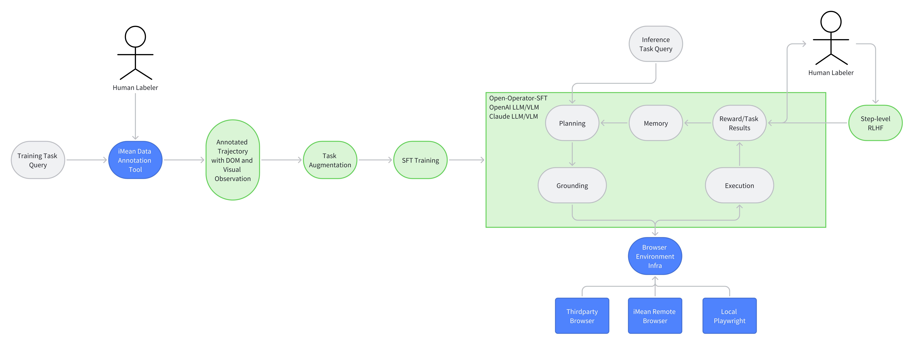
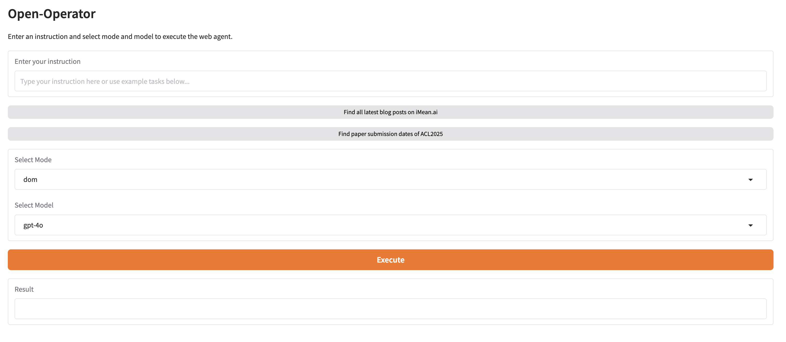

<h1 align="center">Open-Operator: Otwarta wersja OpenAI Operator</h1>


<p align="center">
  <a href="https://github.com/iMeanAI/open-operator/blob/main/LICENSE"></a>
  <a href="https://www.python.org/downloads/release/python-3110/"></a>
  <a href="https://github.com/iMeanAI/open-operator/issues"></a>
  <a href="https://github.com/iMeanAI/open-operator/pulls"></a>
  <a href="https://github.com/iMeanAI/open-operator/stargazers"></a>
  <a href="https://github.com/iMeanAI/open-operator/network/members"></a>

</p>

# open-operator

Ten projekt ma na celu dostarczenie społeczności open-source łatwego w użyciu systemu do budowania, samodzielnego hostowania i oceny modeli agentów sieciowych. Naszym celem jest zaoferowanie alternatywy dla ChatGPT Pro kosztującego 200 dolarów miesięcznie oraz dla niekontrolowanych środowisk chmurowych.

Za pomocą open-operator możesz:
- oznaczać swoje dane z nagranych sesji w przeglądarce,
- eksportować dane do dalszego przetwarzania,
- przygotować je do fine-tuningu nadzorowanego (SFT),
- hostować i wdrażać model do interakcji z prawdziwymi witrynami,
- automatycznie oceniać skuteczność modelu.

Wierzymy, że deweloperzy powinni mieć pełną kontrolę nad swoimi agentami – od treningu, przez wdrożenie, po ewaluację.

## Plan rozwoju

Poniżej przedstawiono krótki plan rozwoju projektu. Zielona część będzie dostępna w tym repozytorium.

## Uruchamianie podstawowego agenta w Open-Operator
### Przygotowanie środowiska
```bash
conda create -n open-operator python=3.11
pip install -r requirements.txt
```

W przypadku środowiska przeglądarkowego możesz użyć [browserbase](https://www.browserbase.com/), aby ustawić następujące zmienne środowiskowe.

```bash
export BROWSERBASE_API_KEY=your_api_key
```

Ustaw dane logowania do iMean Builder jako zmienne środowiskowe:

```bash
export IMEAN_USERNAME=your_username
export IMEAN_PASSWORD=your_password
```


### Inicjalizacja podstawowego agenta
```bash
python inference/app.py
```
Model bazowy możesz wybrać w menu rozwijanym (Anthropic, Google, OpenAI itp.).



Rozpocznij pierwsze doświadczenia z Open-Operator!

## Oznaczanie i pobieranie danych
Kroki do wykonania:
1. Pobierz najnowsze rozszerzenie iMean Builder: [iMean Builder](https://drive.google.com/file/d/1BpLOQ9M41rdc6VYY-1Aes1lhzo5-LdiH/view?usp=sharing)
2. Zainstaluj rozszerzenie w swojej przeglądarce.
3. Zarejestruj dane trajektorii przeglądania w **naturalny** sposób interakcji ze stroną i edytuj tytuły nagrań.
4. Utwórz prywatny kanał na [platformie iMean Builder](https://www.imean.ai/builder) i przenieś tam wszystkie dane. Instrukcja: [Docs](https://webcanvas.gitbook.io/webcanvas-docs/3.-evaluation)
5. Utwórz prywatne wyzwanie na stronie [WebCanvas](https://www.imean.ai/web-canvas) i powiąż je z utworzonym kanałem. Instrukcja: [Docs](https://webcanvas.gitbook.io/webcanvas-docs/3.-evaluation)
6. Pobierz identyfikator wyzwania i użyj go do pobrania wszystkich danych z platformy iMean Builder.

Ustaw identyfikator wyzwania w `configs/config.yaml` oraz podaj dane logowania iMean Builder w zmiennych środowiskowych `IMEAN_USERNAME` i `IMEAN_PASSWORD`.

Uruchom `python main.py`, aby pobrać dane. Domyślne ID wyzwania umożliwia pobranie przykładowych danych.

Jeśli logujesz się do iMean Builder przy pomocy konta Google, hasło możesz ustawić na stronie profilu.


## Przetwarzanie danych

W trybie Dom Tree wystarczy uruchomić `python main.py`.

Aby przygotować dane w trybie Vision, ustaw `mode: "vision"` w pliku
`configs/config.yaml` i uruchom `python main.py`. Przetworzone przykłady zostaną
zapisane w katalogu `data/sft`.


## Trenowanie natywnego modelu agenta
wkrótce

## Ewaluacja natywnego modelu agenta
wkrótce

## Do zrobienia
- [x] Instrukcja oznaczania danych trajektorii
- [x] Pobieranie danych
- [x] Przygotowanie danych do SFT – DOM Tree
- [x] Przygotowanie danych do SFT – Vision
- [ ] Hostowanie lokalnego modelu i inferencja na żywych stronach
- [ ] Automatyczna ewaluacja z wykorzystaniem WebCanvas

## Poprzednie rozwiązania
Przykład ewaluacji agentów sieciowych znajdziesz w repozytorium WebCanvas: [WebCanvas](https://github.com/iMeanAI/WebCanvas)

Więcej informacji o projektach badawczych nad agentami GUI open-source znajdziesz w WebAgentLab ([WebAgentLab Homepage](https://webagentlab.notion.site/homepage)).

**Bądź na bieżąco!**

## OpenOperator-Pro
Ta wersja dodaje pętlę Plan-Act-Observe z Guardrails, pamięć SQLite oraz opcjonalne proxy płatności. Wybór modelu wizji następuje w interfejsie Gradio.

### Szybki start
```bash
pip install -r requirements.txt
playwright install --with-deps
python app.py
```

### Docker
```bash
docker compose up --build

```
### Demo wyniki (5 epizodów WebArena)
Success rate: 0.6
Średnia liczba kroków: 12.4

